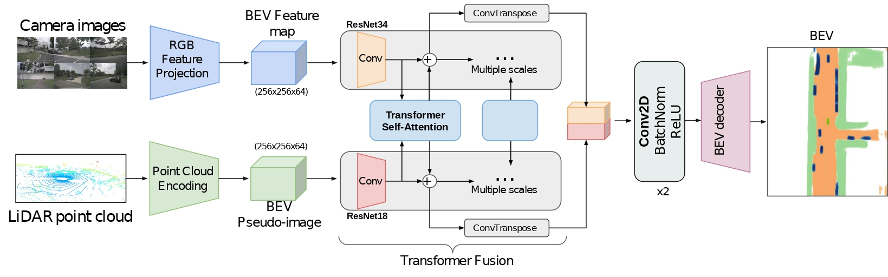
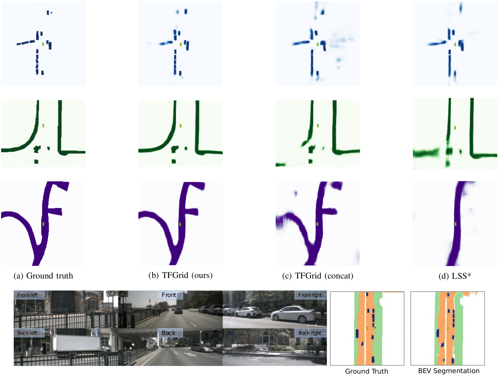

# TransFuseGrid: Transformer-based Lidar-RGB fusion for semantic grid prediction

Semantic grids are a succinct and convenient approach to represent the environment for mobile robotics and autonomous driving applications. While the use of Lidar sensors is now generalized in robotics, most semantic grid prediction approaches in the literature focus only on RGB data. In this paper, we present an approach for semantic grid prediction that uses a transformer architecture to fuse Lidar sensor data with RGB images from multiple cameras. Our proposed method, TransFuseGrid, first transforms both input streams into top-view embeddings, and then fuses these embeddings at multiple scales with Transformers. Finally, a decoder transforms the fused, top-view feature map into a semantic grid of the vehicle's environment. We evaluate the performance of our approach on the nuScenes dataset for the vehicle, drivable area, lane divider and walkway segmentation tasks. The results show that TransFuseGrid achieves superior performance than competing RGB-only and Lidar-only methods. Additionally, the Transformer feature fusion leads to a significative improvement over naive RGB-Lidar concatenation. In particular, for the segmentation of vehicles, our model outperforms state-of-the-art RGB-only and Lidar-only methods by 24% and 53%, respectively.

## Comparison with competing methods
### Results on validation split

Results on the NuScenes validation split. We compare the Intersection over Union (**IOU**) of the generated semantic grids with the competing approaches in validation set. Best results are presented in **bold** font, second best with 🔹Blue.

| Models                         |  Vehicle  | Drivable area | Lane divider |  Walkway  |
|--------------------------------|:---------:|:-------------:|:------------:|:---------:|
| Lift-Splat-Shoot (pre-trained) |   32.80   |       -       |       -      |     -     |
| Lift-Splat-Shoot *             |   28.94   |     61.98     |   **37.41**  |   🔹50.07   |
| Pillar feature Net             |   23.43   |     69.19     |     26.05    |   30.57   |
| TFGrid (concat)                | 🔹32.88   |     🔹74.18     |     30.41    |   43.78   |
| TFGrid (ours)                  | **35.88** |   **78.87**   |    🔹35.70    | **50.98** |

We compare the IOU of the competing approaches in only Night conditions and only Rain conditions. Best results are presented in **bold** font, second best in 🔹Blue.

| Class                          |  Vehicle  |           | Drivable area |           | Lane divider |           |  Walkway  |           |
|--------------------------------|:---------:|:---------:|:-------------:|:---------:|:------------:|:---------:|:---------:|:---------:|
| Models                         |   Night   |    Rain   |     Night     |    Rain   |     Night    |    Rain   |   Night   |    Rain   |
| Lift-Splat-Shoot (pre-trained) |   31.06   |   🔹34.06   |       -       |     -     |       -      |     -     |     -     |     -     |
| Lift-Splat-Shoot *             |   28.41   |   30.81   |     49.13     |   56.86   |   **15.87**  | **34.72** |   🔹24.56   | **46.59** |
| Pillar feature Net             |   28.54   |   19.56   |     63.89     |   64.01   |     3.60     |   23.72   |   23.52   |   27.22   |
| TFGrid (concat)                |   🔹37.8   |   33.52   |     🔹68.98     |   🔹67.25   |     7.27     |   27.90   |   23.60   |   40.98   |
| TFGrid (ours)                  | **39.33** | **37.14** |   **70.45**   | **69.74** |     🔹15.17    |   🔹30.25   | **24.65** |   🔹44.26   |

### Qualitative results
Comparison between ground truth and semantic grid predictions for vehicles (top row), walkway (second row) and drivable area (third row) for different samples in the validation split. We display the class probabilities as a colorscale, without thresholding. In the top row, we can see how the models with Lidar input can detect all vehicles in the scene, while LSS fails to do so, probably due to occlusions. Furthermore, the definition of the detected vehicles with the TFGrid model is much cleaner than TFGrid concat model. In the second row, we see how TFGrid out performs both baselines for walkway class. In the third row, the ability of the models with Lidar input to predict the details of the drivable area is clearly superior to that of LSS. The bottom row shows the combination of the three classes and results compared with the ground truth (*: Lift-Splat model trained by us, using the source code given by the authors.)

## Scene prediction visualization
A scene from nuScenes validation split is used to validate vehicle, drivable_area and walkway classes.

[Video release](https://youtu.be/j2nBqtwcCOo)
Source code to be released upon publication ICARCV 2022.

